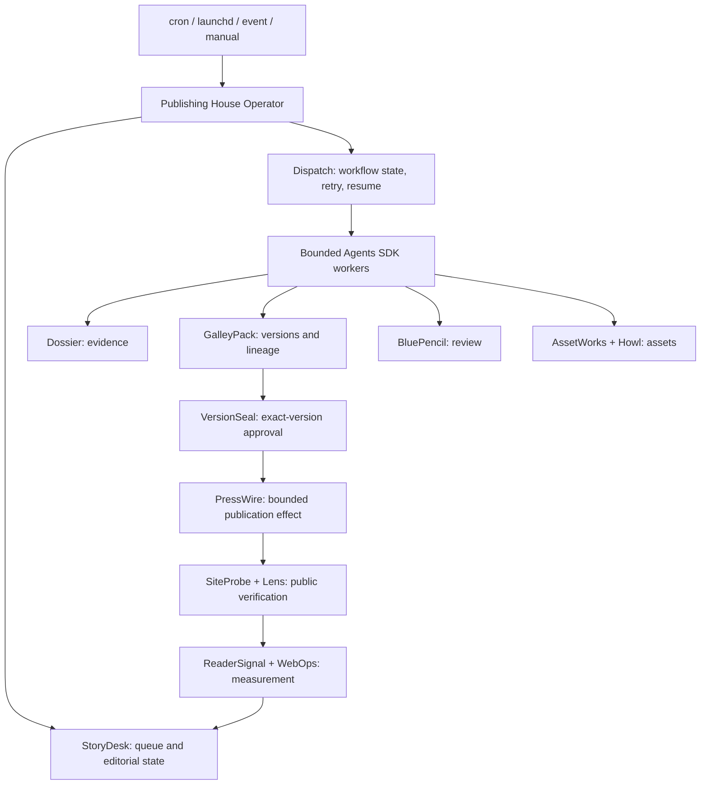

# Kujo Publishing House Operator

The operator is the small, durable control loop above the existing Publishing
House workflow kits. It wakes, reads StoryDesk-backed work, acquires one local
lease, selects bounded work, records checkpoints and receipts, and exits. It is
not an agent, publication database, approval authority, or deployment system.

This repository-owned implementation is a production-capable control plane.
It runs deterministic fixtures for rehearsal and invokes a configured bounded
phase adapter for live work. Missing adapters, credentials, approvals, evidence,
or verification fail closed. The operator never treats a written file or a
successful push as verified publication.

## Ownership



The operator stores only leases, scheduling checkpoints, notifications, and
references. StoryDesk remains the editorial control desk. The eight Publishing
House tools retain their existing authority. Dispatch remains the workflow
runtime. Publication profiles configure sites; no worker prompt owns site paths,
voice, approval, or deployment rules.

## Quick start

```bash
export KUJO_REPOS=/path/to/kujo-repos
export PUBLISHING_HOUSE_STATE=/path/to/publishing-house-state

publishing-house-operator/bin/publishing-house --json init
publishing-house-operator/bin/publishing-house --json doctor
publishing-house-operator/bin/publishing-house --json publication list
```

One-off rambling notes become a preserved SourcePack and StoryDesk idea:

```bash
publishing-house-operator/bin/publishing-house --json intake \
  --publication personal-blog \
  --format technical-essay \
  --priority high \
  --source publishing-house-operator/fixtures/rambled-notes.txt
```

Original bytes are copied under
`.publishing-house/sourcepacks/<id>/originals/`. Normalization adds an editorial
view without replacing those bytes. Repeating identical intake returns the same
deterministic SourcePack and StoryDesk identity.

## Monthly operation

```bash
publishing-house-operator/bin/publishing-house --json plan import \
  publishing-house-operator/fixtures/september-2026.json
publishing-house-operator/bin/publishing-house --json tick --fixture --limit 4
publishing-house-operator/bin/publishing-house --json status
publishing-house-operator/bin/publishing-house --json approvals
publishing-house-operator/bin/publishing-house --json blocked
publishing-house-operator/bin/publishing-house --json history
```

Plans support weekly, monthly, campaign, release, and evergreen queues;
dependencies, priorities, publication windows, series, clusters, adaptations,
and refresh lineage are preserved. Plan import creates deterministic StoryDesk
commissions. A second import is a no-op.

`tick` takes an exclusive local lease, runs health checks, sorts only
dependency-ready work by priority, advances bounded phases, checkpoints after
each item, and exits at the item limit. Interruption loses at most the current
uncommitted phase. Re-running resumes from the stored phase index. Two ticks
cannot hold the same lease. Failures block only their item.

Fixture mode creates deterministic, external-effect-free artifacts for control
loop testing. Without `--fixture`, unavailable live workers block the item and
emit `HARD_BLOCKER`; the operator never substitutes fixtures silently.

Run the full real-tool fixture (all eleven workflows, 38 bounded worker
receipts, 46 record references, exact-version pause/resume, and PressWire local
effect verification) through the operator with:

```bash
publishing-house-operator/bin/publishing-house --json golden-path \
  --out /tmp/publishing-house-golden-path
```

## Publication profiles

The contract is in `schemas/publication-profile.schema.json`. The included
profiles are:

| ID | Source of truth | Production contract | Default approval |
| --- | --- | --- | --- |
| `personal-blog` | `robertdevore.com/content/` | pinned Kujo SSG/SiteKit build; GitHub Pages | exact human |
| `kujolang-ai` | authored Markdown, Howl manifest, site assets | SSG, site contracts, social validation, GitHub Pages | exact human |
| `docs-kujolang-ai` | docs `content/`, source/tests/CLI evidence | docs build and docs-specific validation, `gh-pages` | exact human |
| `agents-kujolang-ai` | canonical `kujo-agents`; site copy is generated | sync, Howl cards, SSG, generated-output validation | exact human |

Add a future publication without framework changes:

```bash
publishing-house-operator/bin/publishing-house --json publication add ./my-publication.json
```

Profiles include identity, repository and source paths, audience, mission,
voice, style, terminology, formats, frontmatter, authorship, claims, evidence,
research, linking, SEO and AI-search policy, assets, accessibility, build/test/
preview commands, deployment, verification, measurement, approval, refresh,
correction, and rollback policy.

Author and publication voices live separately under `voices/`. Worker roles
stay canonical and receive the selected voice/profile at execution time.

## Approval and publication

The default is `REQUIRE_EXACT_HUMAN_APPROVAL`. The operator pauses an item at
publication unless its profile explicitly lists the item's content class under
`automatic_classes`. Automatic classes are publication-specific and narrow:

- agent catalog and social-card regeneration;
- high-confidence docs corrections;
- metadata fixes.

Personal essays, announcements, positioning, competitive, legal, security, and
new public claims remain human-gated. `approve` requires the exact checksum of
the current artifact. Any later byte change creates a different checksum and
invalidates that approval. VersionSeal remains authoritative in the composed
workflow; the operator's approval reference is a routing input, not a substitute
for VersionSeal.

PressWire remains the only component allowed to report a publication effect.
The existing PressWire local adapter proves checksum-bound idempotent effects;
its Git/static provider contract requires preflight, publish, status, correct,
and unpublish operations. Target profiles drive each repository's existing
GitHub Pages behavior rather than replacing it. Live Git push/PR/merge adapters
are intentionally unavailable in this checkout until authenticated operator
configuration is installed and verified.

## Event commissioning and documentation obligations

Event intake never publishes. It records the event and creates policy-selected
StoryDesk candidates:

```bash
publishing-house-operator/bin/publishing-house --json event \
  --input publishing-house-operator/fixtures/release-event.json
```

Current policies distinguish releases, CLI/API changes, agent changes, broken
pages, stale evidence, search opportunities, and performance changes. Unknown
events produce `no-editorial-action`. A release can propose documentation,
article, and social work. Agent events propose canonical sync and card work.

For docs, behavioral claims require source, tests, CLI help, schemas, contracts,
or release artifacts. For agents, the canonical edit is always in
`kujo-agents`; the site performs sync/build/verify and cannot become canonical.

## Adaptations, assets, and post-publication learning

GalleyPack lineage binds adaptations to the approved primary checksum. The
Franchise & Adaptation workflow may produce X, LinkedIn, newsletter, teaser,
FAQ, release-note, case-study, or audiovisual packages only after a primary
artifact exists. AssetWorks records provenance, rights, captions, alt text, and
checksums; Howl supplies deterministic social-card rendering.

Post-publication verification covers HTTP status, canonical URL, visible
content, metadata, structured data, links, accessibility, desktop/mobile
rendering, console errors, sitemap, feeds, and redirects as configured. A push
without public verification is not success. ReaderSignal and WebOps observations
create new StoryDesk candidates; they never silently rewrite published history
or imply causation.

## Scheduling

The scheduler is intentionally dumb. Use one of the templates in `scheduler/`,
replace absolute paths locally, and install it using normal OS administration.
The scheduled command is simply:

```bash
publishing-house --state /absolute/state --repos /absolute/kujo-repos --json tick
```

Use `--fixture` only for rehearsal. Event systems call `event --input FILE` and
then trigger the same `tick`. After correcting a hard blocker, release that item
and resume normal scheduling:

```bash
publishing-house resume ITEM_ID
publishing-house tick
```

### Live phase adapter

Live operation uses one explicit executable boundary rather than embedding a
model provider or publication credential in the operator:

```bash
export PUBLISHING_HOUSE_PHASE_ADAPTER=/absolute/path/to/phase-adapter
export PUBLISHING_HOUSE_PHASE_TIMEOUT_SECONDS=900
publishing-house tick
```

The adapter reads one `publishing-house.phase-request` JSON object from stdin
and writes a JSON envelope to stdout. A successful envelope contains a
`publishing-house.phase-receipt` with the matching item and phase, an existing
artifact path, its SHA-256 checksum, and an explicit `external_effect` value.
Only the `approval-publication` phase may report an external effect; a real
effect must also report `effect_status` as `published`, `corrected`, or
`unpublished`. The operator verifies this receipt before advancing state.

Adapters are deployment configuration. They compose Agents SDK and AI SDK
workers, retrieval, and Kujo tools for editorial phases; the publication phase
must delegate effects to PressWire. Credentials stay in the adapter's OS-backed
credential environment and never enter requests, profiles, or artifacts.

Failures are retried up to the state-configured bound, then block only the
affected item and emit `HARD_BLOCKER`. `resume ITEM_ID` is explicit so a blocked
item cannot silently re-enter the queue before an operator fixes its cause.

## Notifications

Routine success is visible in daily/weekly run summaries, not emitted as an
interrupt. Only these classes create notification records:

`APPROVAL_REQUIRED`, `HARD_BLOCKER`, `EVIDENCE_CONFLICT`, `SOURCE_MISSING`,
`PUBLICATION_FAILURE`, `POST_PUBLISH_VERIFICATION_FAILURE`, `DEADLINE_AT_RISK`,
`BUDGET_EXCEEDED`, `POLICY_VIOLATION`, and `SYSTEM_HEALTH_FAILURE`.

## Recovery and corrections

- Inspect `status`, `blocked`, `approvals`, and `history`.
- Correct missing sources/capabilities and run `tick` again.
- Never edit an approval checksum. Produce a new GalleyPack version and request
  new approval.
- Corrections and unpublishing are new PressWire effects with new VersionSeal
  authority and preserved original receipts.
- Git-backed rollback uses a reviewed revert or restoration of the previous
  generated artifact; no workflow rewrites history or force-pushes.

## Test and clean-machine procedure

```bash
python3 -m unittest publishing-house-operator/tests/test_operator.py -v
python3 scripts/validate_contracts.py
python3 -m unittest discover -s tests -p 'test_*.py'
bash tests/release-readiness.sh
bash tests/clean-checkout.sh
```

The operator suite covers initialization, all four real profiles, StoryDesk
intake and commissions, original-source preservation, deterministic identity,
plan dependencies, checkpoint/resume behavior, low-risk automatic flow,
human approval pause, missing source, duplicate lease, event routing, and
idempotent replay. The existing eleven-workflow proof covers Dossier,
GalleyPack, BluePencil, AssetWorks, VersionSeal, PressWire, ReaderSignal,
Dispatch, canonical role contracts, approval pause/resume, checksum drift,
revision, and duplicate publication prevention.

## Credentials and safety

No profile, SourcePack, plan, prompt, receipt, log, or export may contain a
credential. Live adapters must use OS-backed credentials or the existing Kujo
credential references. Observe/propose workers never inherit publication
authority. Missing credentials, adapters, evidence, approval, or verification
fail closed. State paths should be private to the operator account.

## Deployment dependencies

- A live phase adapter must be installed and configured for the selected model,
  retrieval, and tool providers. The operator contract is provider-portable;
  provider transports remain deployment choices.
- PressWire has a production-shaped Git/static conformance contract. An
  authenticated GitHub push/PR/merge provider must be configured and proven for
  repositories where the adapter is expected to create publication effects.
- ReaderSignal and WebOps measurement require the applicable analytics, search,
  and social provider credentials when those signals are enabled.
- The local lease prevents duplicate work on one filesystem, not distributed
  multi-host execution.
- A physically separate clean host and controlled production publication were
  not authorized by repository policy in this implementation run.

These are explicit deployment gates, not fixture-only architecture. A missing
gate blocks its item without weakening approval or publication authority.
